1\. 

a.Put a breakpoint in line 49 

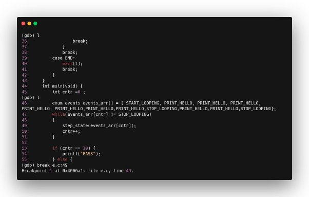

b.Try next command 

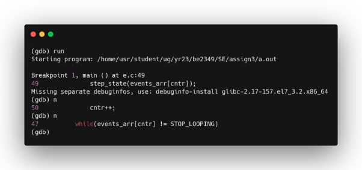

c.How will you get inside the function without using breakpoint? 

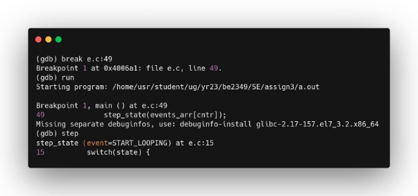

d. How will you come out the of the function without using next and continue? 

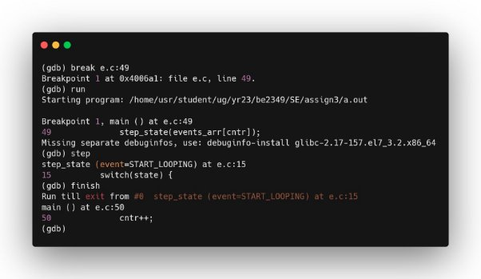

2\. 

1. Set a suitable breakpoint in gdb in the routine 

   show.give valid input and run : 

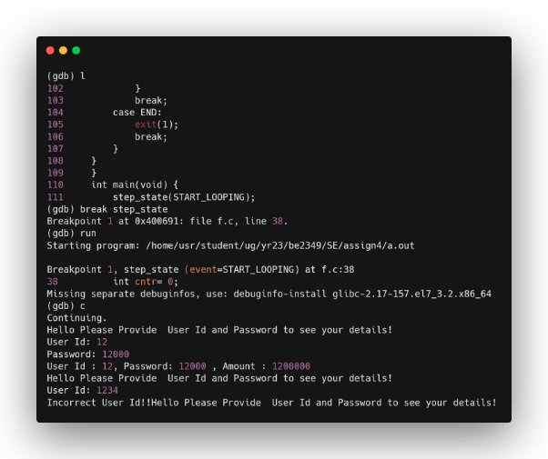

2. How you can see the call stack of the routine. 

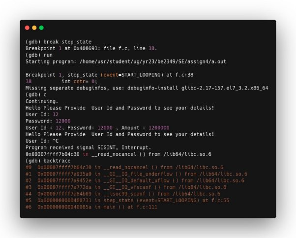

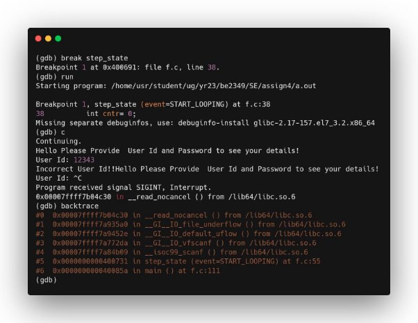

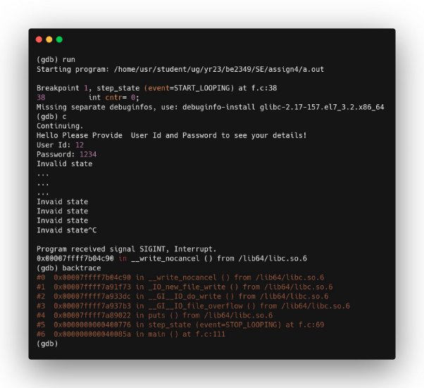

3. Which commands will help you to see each value 

   change of variable “event”? 

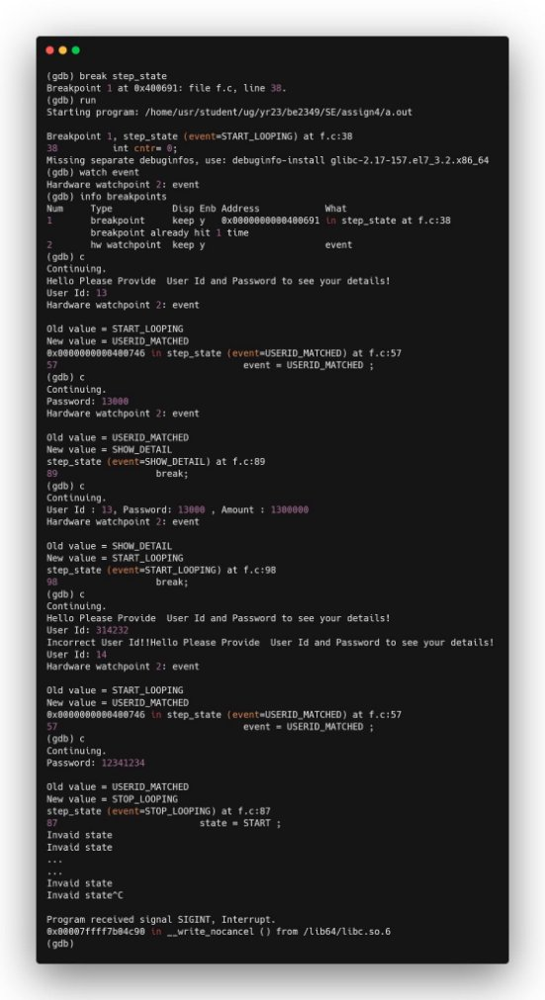

4. Correct the program so that it doesn’t go to infinite loop for wrong password. Rather main 

   iteration restarts . [follow the value change path 

   of event for wrong password] 

   Code snippet causing infinite loop on wrong password 

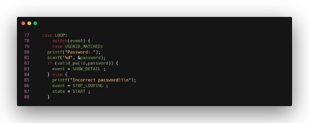

modified 

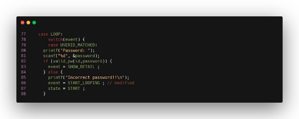

Modified program 

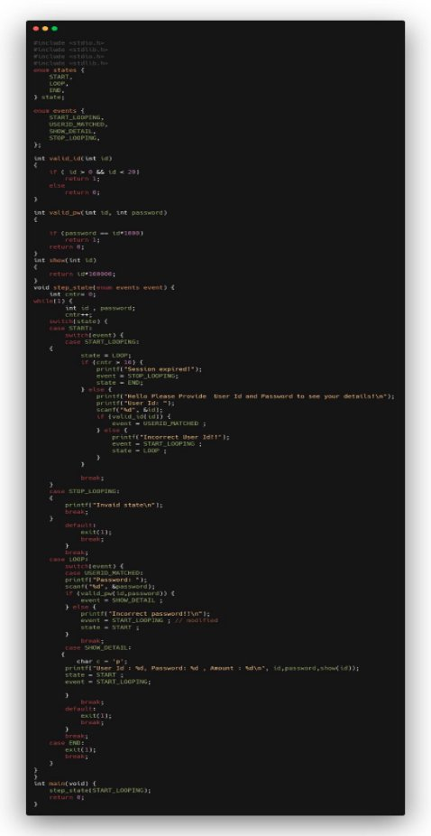Explore the commands found for 5c to see/use 

content of a pointer 
